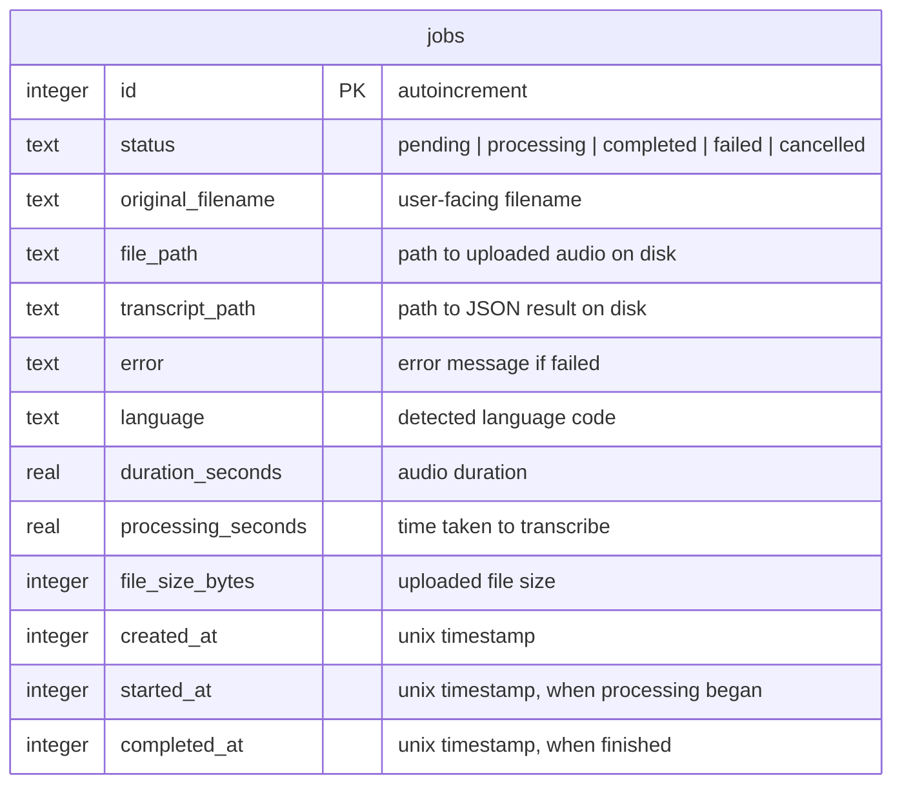

# Phase 1: Transcription Web App MVP

## Overview

Build a Next.js web app that provides drag-and-drop audio file upload, queue-based job processing, WhisperX transcription with word-level timestamps and speaker diarization, a job list dashboard, transcript viewer, and JSON export. Runs on a Windows workstation (RTX 4080) alongside the existing WhisperX Flask server, accessible anywhere via Tailscale.

## Problem Statement

Currently, transcribing podcast episodes requires manually running CLI commands or cURL requests against the WhisperX Flask server. There is no persistent job tracking, no way to view results in a browser, and no foundation for the downstream content pipeline (EDL generation, social clips, show notes). A web interface eliminates friction, enables queue-based batch processing, and provides the platform for Phases 2 and 3.

## Proposed Solution

A **Next.js 15 monorepo** (App Router, TypeScript) with:

- **Frontend**: React UI with drag-and-drop upload, job dashboard, transcript viewer
- **API Routes**: File upload (streaming via busboy), job CRUD, health check proxy
- **Background Worker**: `setInterval`-based poller (started via `instrumentation.ts`) that processes jobs sequentially by calling WhisperX on localhost:9000
- **Database**: SQLite via Drizzle ORM + better-sqlite3
- **File Storage**: Local `data/` directory for uploads and transcripts

## Technical Approach

### Architecture

```
┌──────────────────────────────────────────────────────┐
│                   Windows Workstation                 │
│                  (RTX 4080, Tailscale)                │
│                                                      │
│  ┌─────────────────────┐    ┌─────────────────────┐  │
│  │    Next.js App       │    │  WhisperX Flask     │  │
│  │    (port 3000)       │───▶│  (port 9000)        │  │
│  │                      │    │                     │  │
│  │  ┌───────────────┐   │    │  - large-v3 model   │  │
│  │  │ React Frontend│   │    │  - word alignment   │  │
│  │  └───────────────┘   │    │  - diarization*     │  │
│  │  ┌───────────────┐   │    └─────────────────────┘  │
│  │  │ API Routes    │   │                             │
│  │  └───────────────┘   │    ┌─────────────────────┐  │
│  │  ┌───────────────┐   │    │  SQLite Database    │  │
│  │  │ Background    │───┼───▶│  data/app.db        │  │
│  │  │ Worker        │   │    └─────────────────────┘  │
│  │  └───────────────┘   │                             │
│  └─────────────────────┘    ┌─────────────────────┐  │
│                              │  File Storage       │  │
│                              │  data/uploads/      │  │
│                              │  data/transcripts/  │  │
│                              └─────────────────────┘  │
└──────────────────────────────────────────────────────┘
         ▲
         │ Tailscale (100.67.12.59:3000)
         │
    Any device on Tailscale network
```

*\*Diarization requires extending the existing `whisperX.py` — see Phase 1.1*

### Database Schema (ERD)



Transcription results are stored as JSON files on disk (referenced by `transcript_path`), not as blobs in SQLite. This keeps the database small and makes JSON export trivial.

### Key Technical Decisions

| Decision | Choice | Rationale |
|----------|--------|-----------|
| ORM | Drizzle + better-sqlite3 | Lightweight, type-safe, synchronous (ideal for single-user), zero-config SQLite |
| File uploads | Busboy streaming | Next.js API routes buffer `formData()` in memory; busboy streams directly to disk, supporting files up to 2GB |
| Background worker | `setInterval` + `instrumentation.ts` | No Redis/BullMQ needed for a single-user local tool. `instrumentation.ts` starts the worker when Next.js boots |
| Job processing | Sequential (one at a time) | WhisperX Flask server is single-threaded (`threaded=False`); queueing is handled by SQLite |
| Dashboard updates | Client-side polling (5s interval) | Simplest approach; SSE/WebSocket complexity not warranted for single-user |
| File naming | UUID-based | Avoids filename collisions, preserves `original_filename` in DB |
| WhisperX model | Fixed to large-v3 | Hardcoded in Phase 1; model selection deferred |
| Authentication | None (Tailscale is the auth boundary) | Single-user tool on a private network |

---

## Implementation Phases

### Phase 1.0: Project Bootstrap

Set up the Next.js project, database, and file structure.

#### Tasks

- [x] Initialize git repository with `.gitignore` (`node_modules/`, `.next/`, `.env`, `data/`, `*.db`)
- [x] Create Next.js 15 project with TypeScript and App Router (`app/` directory)
  - `npx create-next-app@latest . --typescript --app --tailwind --eslint --src-dir --no-import-alias`
- [x] Install dependencies:
  ```
  npm i drizzle-orm better-sqlite3 busboy uuid
  npm i -D drizzle-kit @types/better-sqlite3 @types/busboy @types/uuid
  ```
- [x] Create data directories structure (gitignored):
  ```
  data/
  ├── uploads/      # uploaded audio files (UUID-named)
  └── transcripts/  # JSON transcription results (UUID-named)
  ```
- [x] Create `.env.example` with configuration:
  ```env
  WHISPERX_URL=http://localhost:9000
  HF_TOKEN=              # HuggingFace token for pyannote diarization
  DATABASE_PATH=data/app.db
  UPLOAD_DIR=data/uploads
  TRANSCRIPT_DIR=data/transcripts
  POLL_INTERVAL_MS=5000
  ```
- [x] Create `CLAUDE.md` with project conventions

#### Files

- `.gitignore`
- `.env.example`
- `CLAUDE.md`
- `package.json` (generated by create-next-app, then modified)
- `next.config.ts`
- `tsconfig.json` (generated)

---

### Phase 1.1: Extend WhisperX Flask Server for Diarization

**Critical prerequisite.** The existing `whisperX.py` does NOT support speaker diarization. It must be extended before the web app can deliver on the "speaker diarization" requirement.

#### Tasks

- [ ] Add `diarize` query parameter to `/transcribe` endpoint (default: `true`)
- [ ] Add `hf_token` environment variable support for pyannote model download
- [ ] Implement diarization pipeline in the Flask server:
  1. Transcribe with `whisperx.transcribe()`
  2. Align with `whisperx.align()` (already supported via `align=true`)
  3. Load `DiarizationPipeline` with HuggingFace token
  4. Run `diarize_model(audio)` to get speaker segments
  5. Call `whisperx.assign_word_speakers(diarize_segments, result)` to assign speakers to words
- [ ] Update response schema to include speaker labels per word/segment:
  ```json
  {
    "words": [
      {"word": "hello", "start": 0.0, "end": 0.3, "score": 0.95, "speaker": "SPEAKER_00"}
    ],
    "segments": [
      {"start": 0.0, "end": 2.5, "text": "...", "speaker": "SPEAKER_00", "words": [...]}
    ]
  }
  ```
- [ ] Cache the diarization model after first load (same pattern as existing WhisperX model caching)
- [ ] Handle missing HF token gracefully: if `diarize=true` but no token, return transcription without diarization + a warning field
- [ ] Test end-to-end with a sample multi-speaker audio file

#### Files

- `whisperX.py` (modify existing)

---

### Phase 1.2: Database Layer

Set up Drizzle ORM with SQLite schema and migrations.

#### Tasks

- [x] Create database connection singleton with WAL mode

  ```typescript
  // src/lib/db/index.ts
  import { drizzle } from 'drizzle-orm/better-sqlite3';
  import Database from 'better-sqlite3';
  import * as schema from './schema';

  const sqlite = new Database(process.env.DATABASE_PATH || 'data/app.db');
  sqlite.pragma('journal_mode = WAL');
  export const db = drizzle({ client: sqlite, schema });
  ```

- [x] Define jobs table schema

  ```typescript
  // src/lib/db/schema.ts
  import { integer, real, sqliteTable, text } from 'drizzle-orm/sqlite-core';

  export const jobs = sqliteTable('jobs', {
    id: integer('id').primaryKey({ autoIncrement: true }),
    status: text('status').notNull().default('pending'),
    originalFilename: text('original_filename').notNull(),
    filePath: text('file_path').notNull(),
    transcriptPath: text('transcript_path'),
    error: text('error'),
    language: text('language'),
    durationSeconds: real('duration_seconds'),
    processingSeconds: real('processing_seconds'),
    fileSizeBytes: integer('file_size_bytes'),
    createdAt: integer('created_at', { mode: 'timestamp' }).notNull().$defaultFn(() => new Date()),
    startedAt: integer('started_at', { mode: 'timestamp' }),
    completedAt: integer('completed_at', { mode: 'timestamp' }),
  });
  ```

- [x] Create `drizzle.config.ts`
- [x] Generate and run initial migration (`npx drizzle-kit generate && npx drizzle-kit migrate`)
- [x] Add index on `status` column for worker query performance

#### Files

- `src/lib/db/index.ts`
- `src/lib/db/schema.ts`
- `drizzle.config.ts`
- `drizzle/` (generated migration files)

---

### Phase 1.3: API Routes

Build the backend API endpoints.

#### 1.3a: File Upload Endpoint

- [x] `POST /api/upload` — Accept multipart audio file, stream to disk via busboy, create job in SQLite
  - Stream file to `data/uploads/{uuid}.{ext}`
  - Validate file extension against allowed types: `mp3, wav, m4a, flac, ogg, webm`
  - Store `original_filename`, `file_path`, `file_size_bytes` in job record
  - Return `{ jobId, status: 'pending' }`
  - Set `export const runtime = 'nodejs'` for stream/fs access

#### 1.3b: Job CRUD Endpoints

- [x] `GET /api/jobs` — List all jobs, sorted by `created_at` descending
  - Return `{ jobs: [...] }` (without transcript data, just metadata)
- [x] `GET /api/jobs/[id]` — Get single job with full details
  - If completed, include `transcriptPath` (client fetches transcript separately)
  - Return `404` if job not found
- [x] `POST /api/jobs/[id]/retry` — Reset a failed/cancelled job to pending
  - Set `status = 'pending'`, clear `error`, `startedAt`, `completedAt`
- [x] `DELETE /api/jobs/[id]` — Delete a job and its associated files
  - Remove uploaded audio file and transcript JSON from disk
  - Delete job record from SQLite
  - Return `404` if not found, `409` if job is currently processing
- [x] `POST /api/jobs/[id]/cancel` — Cancel a pending job
  - Only works for `pending` status (cannot cancel `processing`)
  - Set `status = 'cancelled'`

#### 1.3c: Transcript Endpoint

- [x] `GET /api/jobs/[id]/transcript` — Return the transcription JSON for a completed job
  - Read from `data/transcripts/{uuid}.json`
  - Return `404` if not found or job not completed
  - Set `Content-Disposition` header for download when `?download=true` query param

#### 1.3d: Health Check Proxy

- [x] `GET /api/health` — Proxy to WhisperX `/health` endpoint
  - Call `http://localhost:9000/health` with a 5-second timeout
  - If WhisperX is unreachable, return `{ whisperx: 'offline' }` with 200 (not 500 — the web app itself is healthy)
  - Include WhisperX model info, device, GPU status when available

#### Files

- `src/app/api/upload/route.ts`
- `src/app/api/jobs/route.ts`
- `src/app/api/jobs/[id]/route.ts`
- `src/app/api/jobs/[id]/retry/route.ts`
- `src/app/api/jobs/[id]/cancel/route.ts`
- `src/app/api/jobs/[id]/transcript/route.ts`
- `src/app/api/health/route.ts`

---

### Phase 1.4: Background Worker

Implement the job processing worker that polls SQLite and calls WhisperX.

#### Tasks

- [x] Create worker module with `setInterval`-based polling

  ```typescript
  // src/lib/worker.ts
  // - Poll SQLite for oldest 'pending' job
  // - Set status to 'processing', record startedAt
  // - Send audio file to WhisperX POST /transcribe (align=true, diarize=true)
  // - Save response JSON to data/transcripts/{uuid}.json
  // - Update job: status='completed', transcriptPath, language, durationSeconds, processingSeconds
  // - On error: status='failed', error=message
  ```

- [x] Implement WhisperX client function
  - Use `fetch` with `FormData` to POST to `http://localhost:9000/transcribe`
  - Read uploaded file from disk and attach as multipart
  - Set long timeout (30 minutes) for large files
  - Pass `align=true` always, `diarize=true` by default
- [x] Implement crash recovery on worker startup
  - On start, find any jobs stuck in `processing` state
  - If `started_at` is older than 60 minutes, reset to `pending`
  - Log a warning when recovering stale jobs
- [x] Guard against HMR double-start in development
  - Use `globalThis.__workerStarted` flag
- [x] Register worker via `instrumentation.ts`

  ```typescript
  // src/instrumentation.ts
  export async function register() {
    if (process.env.NEXT_RUNTIME === 'nodejs') {
      const { startWorker } = await import('./lib/worker');
      startWorker(parseInt(process.env.POLL_INTERVAL_MS || '5000'));
    }
  }
  ```

#### Files

- `src/lib/worker.ts`
- `src/lib/whisperx-client.ts`
- `src/instrumentation.ts`

---

### Phase 1.5: Frontend — Layout and Dashboard

Build the React UI components.

#### Tasks

- [x] Create app layout with sidebar/header
  - App name: "Diggnation Pipeline" (or similar)
  - WhisperX status indicator (green dot = online, red = offline)
  - Navigation: Dashboard (default), Upload
- [x] Create Job Dashboard page (`src/app/page.tsx`)
  - Fetch jobs from `GET /api/jobs`
  - Poll every 5 seconds for updates (`useEffect` + `setInterval` or SWR with `refreshInterval`)
  - Display job list as cards or table rows:
    - Original filename
    - Status badge (color-coded: pending=yellow, processing=blue, completed=green, failed=red, cancelled=gray)
    - Duration (if known)
    - Created timestamp (relative, e.g., "5 minutes ago")
    - Processing time (if completed)
  - Click a job to navigate to transcript viewer
  - Action buttons per job: Retry (failed/cancelled), Cancel (pending), Delete (any except processing)
- [x] Create WhisperX health indicator component
  - Poll `GET /api/health` every 30 seconds
  - Show model name and GPU info on hover/tooltip

#### Files

- `src/app/layout.tsx`
- `src/app/page.tsx` (dashboard)
- `src/components/job-list.tsx`
- `src/components/job-card.tsx`
- `src/components/status-badge.tsx`
- `src/components/health-indicator.tsx`

---

### Phase 1.6: Frontend — Upload

Build the drag-and-drop upload interface.

#### Tasks

- [x] Create Upload page or modal (`src/app/upload/page.tsx`)
  - Drag-and-drop zone with visual feedback (border highlight on drag over)
  - Click-to-browse fallback
  - Accept multiple files
  - File type validation on client side (mp3, wav, m4a, flac, ogg, webm)
  - Show file size and name before upload
- [x] Implement upload progress tracking
  - Use `XMLHttpRequest` (not `fetch`) for upload progress events
  - Show progress bar per file during upload
  - After upload completes, show "Queued" confirmation with link to dashboard
- [x] Handle upload errors gracefully
  - Network errors, server errors, file too large
  - Show error message with retry option

#### Files

- `src/app/upload/page.tsx`
- `src/components/upload-zone.tsx`
- `src/components/upload-progress.tsx`

---

### Phase 1.7: Frontend — Transcript Viewer

Build the transcript viewing and export interface.

#### Tasks

- [x] Create Transcript Viewer page (`src/app/jobs/[id]/page.tsx`)
  - Fetch job details from `GET /api/jobs/[id]`
  - If not completed, show status and redirect/link to dashboard
  - If completed, fetch transcript from `GET /api/jobs/[id]/transcript`
- [x] Display transcript in segment-by-segment view
  - Each segment shows:
    - Speaker label (e.g., "SPEAKER_00") with a color assignment
    - Segment text
    - Start/end timestamps (formatted as HH:MM:SS)
  - Expandable word-level detail per segment:
    - Each word with its start time, end time, and confidence score
    - Color-code confidence (green ≥ 0.8, yellow ≥ 0.5, red < 0.5)
- [x] Implement JSON export button
  - Download transcript via `GET /api/jobs/[id]/transcript?download=true`
  - Filename: `{original_filename}_transcript.json`
- [x] Show job metadata panel
  - Original filename, duration, language detected, processing time, realtime factor
  - Created/completed timestamps

#### Files

- `src/app/jobs/[id]/page.tsx`
- `src/components/transcript-viewer.tsx`
- `src/components/segment-row.tsx`
- `src/components/word-detail.tsx`
- `src/components/job-metadata.tsx`

---

## Alternative Approaches Considered

| Approach | Why Rejected |
|----------|-------------|
| Python FastAPI backend + Next.js frontend | User prefers unified TypeScript codebase; WhisperX Flask server already exists separately |
| Streamlit/Gradio for UI | Less flexible for custom UI components needed in Phases 2-3; harder to build drag-and-drop, complex viewers |
| Separate Node.js worker process | Unnecessary complexity for single-user tool; `setInterval` in-process is sufficient |
| PostgreSQL | Overkill for single-user tool; SQLite is zero-config and file-based |
| Redis + BullMQ for job queue | Adds infrastructure dependency; SQLite-as-queue is sufficient for sequential single-user processing |
| WebSocket for real-time updates | Over-engineering for single-user; polling every 5s is indistinguishable UX-wise |

---

## Acceptance Criteria

### Functional Requirements

- [ ] User can drag-and-drop one or more audio files (mp3, wav, m4a, flac, ogg, webm) to upload
- [ ] User can click to browse and select files for upload
- [ ] Upload shows progress indication for each file
- [ ] Each upload creates a job in "pending" status
- [ ] Jobs are displayed in a dashboard list with status, filename, and timestamps
- [ ] Jobs process sequentially in FIFO order via background worker
- [ ] Job status updates are visible within 5 seconds on the dashboard
- [ ] Completed jobs show full transcript with word-level timestamps
- [ ] Completed jobs show speaker labels (diarization) per segment
- [ ] User can download transcript as JSON
- [ ] User can retry a failed job
- [ ] User can cancel a pending job
- [ ] User can delete any job (except currently processing)
- [ ] WhisperX service health status is visible in the UI
- [ ] App handles WhisperX being offline (jobs queue, clear messaging)

### Non-Functional Requirements

- [ ] App is accessible via Tailscale from any device
- [ ] Large files (up to 2GB) upload without memory issues (streaming)
- [ ] Worker recovers from crashes (stale job detection on startup)
- [ ] SQLite uses WAL mode for concurrent read/write safety
- [ ] No authentication required (Tailscale is the access boundary)

### Quality Gates

- [ ] TypeScript strict mode enabled, no `any` types in application code
- [ ] All API routes return proper HTTP status codes and error messages
- [ ] File cleanup on job deletion (no orphaned files on disk)
- [ ] Graceful handling of WhisperX being unavailable

---

## Dependencies & Prerequisites

| Dependency | Status | Action Needed |
|-----------|--------|--------------|
| WhisperX Flask server (`whisperX.py`) | ✅ Exists | Extend with diarization support (Phase 1.1) |
| Node.js 20+ | ❓ Check | Verify installation on Windows workstation |
| HuggingFace token | ❌ Not set up | Create account, accept pyannote terms, get token |
| Tailscale | ✅ Running | Verify Next.js port 3000 is accessible |
| RTX 4080 + CUDA | ✅ Running | WhisperX already uses it |

---

## Risk Analysis & Mitigation

| Risk | Impact | Likelihood | Mitigation |
|------|--------|-----------|------------|
| VRAM contention with other GPU services | Job fails with CUDA OOM | Medium | Worker catches error, marks job as failed with clear message; user can retry after freeing VRAM |
| Large file upload timeout | Upload appears to hang | Medium | Busboy streaming avoids memory issues; client-side progress bar provides feedback |
| WhisperX model not loaded on first request | First job takes extra 30-60s | Low | Health check warns when model isn't loaded; first request triggers lazy load (existing behavior) |
| HMR in dev starts multiple workers | Duplicate job processing | Medium | `globalThis.__workerStarted` guard prevents double-start |
| Database lock contention | Worker and API route conflict | Low | WAL mode + sequential worker eliminates most contention |

---

## Project Structure

```
diggnation-pipeline/
├── src/
│   ├── app/
│   │   ├── layout.tsx
│   │   ├── page.tsx                    # Dashboard
│   │   ├── upload/
│   │   │   └── page.tsx                # Upload page
│   │   ├── jobs/
│   │   │   └── [id]/
│   │   │       └── page.tsx            # Transcript viewer
│   │   └── api/
│   │       ├── upload/
│   │       │   └── route.ts            # File upload
│   │       ├── jobs/
│   │       │   ├── route.ts            # List jobs
│   │       │   └── [id]/
│   │       │       ├── route.ts        # Get/delete job
│   │       │       ├── retry/
│   │       │       │   └── route.ts    # Retry job
│   │       │       ├── cancel/
│   │       │       │   └── route.ts    # Cancel job
│   │       │       └── transcript/
│   │       │           └── route.ts    # Get transcript
│   │       └── health/
│   │           └── route.ts            # WhisperX health proxy
│   ├── components/
│   │   ├── job-list.tsx
│   │   ├── job-card.tsx
│   │   ├── status-badge.tsx
│   │   ├── health-indicator.tsx
│   │   ├── upload-zone.tsx
│   │   ├── upload-progress.tsx
│   │   ├── transcript-viewer.tsx
│   │   ├── segment-row.tsx
│   │   ├── word-detail.tsx
│   │   └── job-metadata.tsx
│   ├── lib/
│   │   ├── db/
│   │   │   ├── index.ts               # DB connection singleton
│   │   │   └── schema.ts              # Drizzle schema
│   │   ├── worker.ts                   # Background job processor
│   │   └── whisperx-client.ts          # WhisperX HTTP client
│   └── instrumentation.ts              # Worker bootstrap
├── data/                               # Gitignored runtime data
│   ├── uploads/
│   └── transcripts/
├── drizzle/                            # Generated migrations
├── drizzle.config.ts
├── next.config.ts
├── .env.example
├── .gitignore
├── CLAUDE.md
└── package.json
```

---

## References & Research

### Internal References
- Brainstorm: `docs/brainstorms/2026-03-17-web-app-transcription-pipeline-brainstorm.md`
- Full pipeline architecture: `brainstorm.md`
- WhisperX server: `whisperX.py`
- Access documentation: `accessing_transcriber.md`

### External References
- [Drizzle ORM — SQLite Getting Started](https://orm.drizzle.team/docs/get-started-sqlite)
- [Next.js App Router Route Handlers](https://nextjs.org/docs/app/api-reference/file-conventions/route)
- [Handling Large File Uploads in Next.js with Busboy](https://dev.to/grimshinigami/how-to-handle-large-filefiles-streams-in-nextjs-13-using-busboymulter-25gb)
- [Next.js instrumentation.ts](https://nextjs.org/docs/app/building-your-application/optimizing/instrumentation)
- [WhisperX GitHub](https://github.com/m-bain/whisperX)
